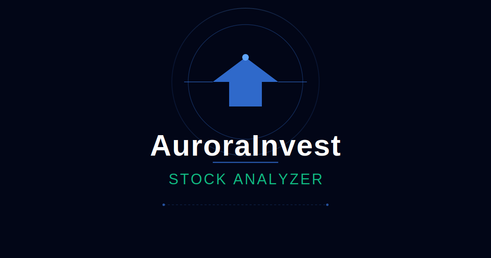

# AuroraInvest Stock Analyzer MVP



A production-ready investment analysis tool that provides comprehensive stock analysis with fundamentals, technicals, sentiment, and scenario-based planning guidance.

## 🎯 Features

- **Single-Stock Analysis**: Analyze any stock with comprehensive insights
- **Multi-Dimensional Analysis**:
  - Fundamentals & Valuation (P/E ratios, growth rates, margins)
  - Technical Analysis (trend, momentum, price positioning)
  - Market Sentiment (analyst consensus, price targets, news)
- **3-Month Scenario Engine**: Bull/Base/Bear projections with probabilities
- **Framework-Based Guidance**: Position sizing, timing, risk considerations
- **Interactive Visualizations**: Charts for scenarios, fundamentals, technicals
- **Export Functionality**: Download JSON or print reports
- **Dark Modern Theme**: Professional AuroraInvest design

## 🚀 Getting Started

### Prerequisites

- Node.js 18+ and yarn

### Installation

```bash
# Install dependencies
yarn install

# Run development server
yarn dev
```

Open [http://localhost:3000](http://localhost:3000) to view the app.

### Build for Production

```bash
yarn build
yarn start
```

## 📊 Available Stocks (Mock Data)

The MVP includes mock data for:
- **AAPL** - Apple Inc.
- **MSFT** - Microsoft Corporation
- **TSLA** - Tesla, Inc.
- **GOOGL** - Alphabet Inc.
- **NVDA** - NVIDIA Corporation

## 🏗️ Architecture

### Tech Stack
- **Framework**: Next.js 14 with React 18
- **Language**: TypeScript
- **Styling**: CSS Modules with CSS Variables
- **Charts**: Recharts
- **State Management**: React Hooks

### Project Structure

```
aurora_invest_app/
├── app/
│   ├── page.tsx           # Main application entry
│   ├── layout.tsx         # Root layout
│   └── globals.css        # Global styles & theme
├── components/
│   ├── stock-form.tsx              # User input form
│   ├── analysis-dashboard.tsx      # Results display
│   ├── scenario-cards.tsx          # Bull/Base/Bear scenarios
│   ├── fundamentals-card.tsx       # Fundamentals analysis
│   ├── technicals-card.tsx         # Technical analysis
│   ├── sentiment-card.tsx          # Market sentiment
│   └── export-buttons.tsx          # JSON/Print export
├── lib/
│   ├── domain/
│   │   ├── AnalysisTypes.ts        # Core type definitions
│   │   └── auroraEngine.ts         # Pure analysis engine
│   ├── services/
│   │   └── marketDataService.ts    # Data abstraction layer
│   └── data/
│       └── mockData.ts             # Mock stock data
└── public/
    └── favicon.svg                 # Brand icon
```

## 🧠 Analysis Engine

The core analysis engine (`auroraEngine.ts`) is:
- **Pure & Testable**: No side effects, deterministic output
- **Extensible**: Designed for future portfolio analysis
- **Framework-Style**: No personalized advice, emphasizes uncertainty

### Analysis Pipeline

1. **Fundamentals Classification**: Strong/OK/Weak based on metrics
2. **Valuation Analysis**: Cheap/Fair/Rich using PEG ratios
3. **Technical Analysis**: Trend detection (SMAs) + momentum (RSI)
4. **Sentiment Analysis**: Analyst consensus + news themes
5. **Scenario Generation**: 3-month Bull/Base/Bear projections
6. **Planning Guidance**: Position sizing, timing, risk notes

## 🛡️ Important Guardrails

⚠️ **This tool is for educational purposes only and does NOT constitute financial advice.**

- Uses framework language ("many investors with similar profiles...")
- Emphasizes uncertainty in all projections
- Includes prominent disclaimers
- No personalized "you should buy/sell" guidance
- Always recommends consulting licensed financial professionals

## 🔮 Future Enhancements

The architecture supports future extensions:
- [ ] Real-time market data integration (APIs)
- [ ] Full portfolio analysis (multiple holdings)
- [ ] Historical portfolio tracking
- [ ] Multi-stock comparison mode
- [ ] User accounts & saved analyses
- [ ] Advanced scenario modeling
- [ ] Sector/industry analysis

## 📄 License

MIT License - See LICENSE file for details

## 🤝 Contributing

Contributions are welcome! Please open an issue or submit a pull request.

---

**Built with ❤️ by the AuroraInvest Team**